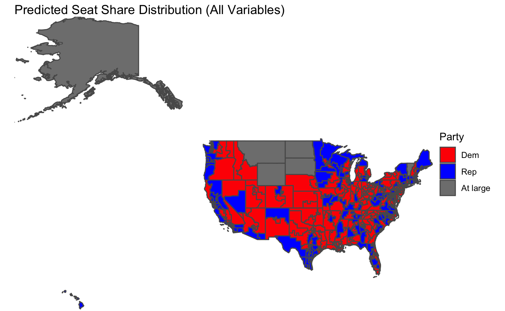

# Intro

This blog includes my final prediction for the 2022 Midterm elections. Over the past 10 weeks, I have looked at various variables, assessing their predictive power, with the goal of creating a prediction model. The outcome of my model is a national vote share prediction.

# The Last 10 Weeks

Before I share my model, I think it is important to summarize what variables I have considered before arriving at my final model. I started by looking at economic fundamentals, assessing GDP, unemployment, and inflation. I found that subsetting the data to the last quarter of the election cycle was the most predictive( Healy and Lenz, 2014).. I then looked at polling data, specifically the average generic ballot within the 50 days prior to the election. I then shifted to looking at district level variables. This included incumbency and expert ratings. I also considered the "air war" and advertising trends (cost, tone, purpose) grouped by district. Finally, I considered demographics and turnout at both a district and national level. Each of these variables include different variations, resulting in another group of variables to consider. For example, with incumbent data, I looked at the incumbent House party, the incumbent president party, and when these parties match. The challenge became choosing the variables.

```{r setup, include = F}
# Packages
knitr::opts_chunk$set(echo = FALSE)

install.packages("tidyverse", repos = "http://cran.us.r-project.org")
library(tidyverse)
install.packages("ggplot2", repos = "http://cran.us.r-project.org")
library(ggplot2)
install.packages("blogdown", repos = "http://cran.us.r-project.org")
library(blogdown)
install.packages("stargazer", repos = "http://cran.us.r-project.org")
library(stargazer)
library(lubridate)
```

```{r, include = F}
# Read in model data
modelDF2 <- read_csv("fundamentals_polls.Oct.csv") 
df <- read_csv("df.csv")

# Seats
seats <- read_csv("house nationwide vote and seat share by party 1948-2020.csv") %>% 
  select(year, D_seats, R_seats)

# Historical Polls
polls <- read_csv("GenericPolls1942_2020 (1).csv") %>% 
  filter(days_until_election > 0) %>%
  filter(days_until_election <= 14) %>% 
  group_by(year) %>% 
  mutate(aveD = as.double(mean(dem))) %>% 
  select(year, aveD) %>% 
  distinct() %>% 
  filter(year%%4!=0)

#Current Polls
currentPolls <- read_csv("generic_ballot_polls (2).csv") %>%
  mutate(days_until_election = mdy(election_date) - mdy(end_date)) %>% 
  filter(days_until_election > 0) %>%
  filter(days_until_election <= 14) %>% 
  mutate(aveD1 = as.double(mean(dem)),
         aveR1 = as.double(mean(rep))) %>% 
  select(aveD1, aveR1) %>% 
  distinct(aveD1, aveR1) %>% 
  mutate(aveD = aveD1/(aveD1+aveR1),
         aveR = aveR1/(aveD1+aveR1))

# Historical data on party in power of pres and house (from Luke Tomes)
party <- read_csv("party_power.csv") %>% 
  rename("year" = "Year") %>% 
  filter(year%%4!=0) %>% 
  mutate(party = case_when(pres_party_in_power_at_election == "D" ~ 1,
                           pres_party_in_power_at_election == "R" ~ -1))

# From census -- national level race and education among voters 
race <- read_csv("Race.xlsx - A1 (1).csv") %>% 
  rename("year" = "Year")
education <- read_csv("Education.xlsx - A2 (1).csv") %>% 
  rename("year" = "Year")

# Combine data
modelDF <- modelDF2 %>% 
  distinct(year, D_majorvote_pct, R_majorvote_pct, CPIAUCSL, DSPIC_change_pct, GDP_growth_qt, UNRATE) %>% 
  left_join(race, by = "year") %>% 
  left_join(education, by = "year") %>%
  left_join(seats, by = "year") %>%
  distinct() %>% 
  mutate(white = `White CVAP` - lag(`White CVAP`, order_by = year),
         black = `Black CVAP` - lag(`Black CVAP`, order_by = year),
         asian = `Asian CVAP` - lag(`Asian CVAP`, order_by = year),
         hispanic = `Hispanic CVAP` - lag(`Hispanic CVAP`, order_by = year),
         male = `Male CVAP` - lag(`Male CVAP`, order_by = year),
         female = `Femal CVAP` - lag(`Femal CVAP`, order_by = year),
         NoHs = `< 9th` - lag(`< 9th`, order_by = year),
         NoGED = `No GED` - lag(`No GED`, order_by = year),
         HSGrad = `HS Grad` - lag(`HS Grad`, order_by = year),
         college = `College` - lag(`College`, order_by = year),
         BAPlus = `BA or more` - lag(`BA or more`, order_by = year),
         PrevDSeats = lag(D_seats, order_by = year),
         PrevDVS =lag(D_majorvote_pct, order_by = year),
         whiteHis = (white - hispanic),
         collegeNO = college - NoGED) %>%
  left_join(polls, by = "year") %>% 
  left_join(party, by = "year") %>% 
  mutate(houseParty = case_when(house_winner_party == "D" ~ 1,
                                house_winner_party == "R" ~ -1),
         partyMatch = case_when(houseParty == party ~ 1,
                                houseParty != party ~ -1)) %>% 
  mutate(aveR = 100-aveD) %>% 
  distinct()
```

```{r, include = F}
# Create train data
modelTrain <- modelDF[-c(3,5),] %>% 
  filter(year%%4!=0)

# Create test data for 2022 prediction
modelTest <- modelDF %>% 
  filter(year > 2018) %>% 
  mutate(party = 1) %>% 
  mutate(UNRATE = 3.5,
         houseParty = 1,
         aveD = 0.506271 * 100,
         aveR = 52,
         partyMatch = 1,
         whiteHis = -.2,
         collegeNO = -.2,
         midterm = 1) %>% 
  select(-c(D_majorvote_pct, D_seats, R_majorvote_pct, R_seats))

# Create test data for model testing
plotTest <- modelDF %>% 
  filter(year%%4!=0) %>% 
  select(-c(D_majorvote_pct, D_seats))
plotTest <- plotTest[-2,]

```

# Building My Final Model

When deciding on my final model, I built three variations of a similar model. I will walk through my thought process for choosing which variation I selected.

The final variables I considered were:

1.  **Average democrat polling (50 days):** This the average of the democratic generic ballot polls from 50 days prior to the election. The generic ballot is an effective way of understanding the public's view and filtering for the days leading up to the election gets a better sense of the true pulse of the country (Bafumi, Erikson, Wlezien, 2018).

2.  **President party:** This is a binary variable with 1 being Democrat and -1 being Republican. Often the party in power is [punished](https://fivethirtyeight.com/features/why-the-presidents-party-almost-always-has-a-bad-midterm/) during the midterms.

3.  **Presidential and party match:** A binary variable with 1 being the parties match and -1 being the parties don't match. This is a continuation of the previous variable, but my hypothesis is that if the party matches there will be a larger punishment.

4.  **Change in percent of white voters:** This the white vote share from that election minus the white vote share from the previous election. As seen in lab, white and Hispanic voters had the strongest coefficient toward prediction democratic vote share.

5.  **Change in Hispanic voters:** This the Hispanic vote share from that election minus the Hispanic vote share from the previous election.

Below I show the regression outputs for the three models I considered.

```{r, include = F}
knitr::opts_chunk$set(echo = FALSE)

# Model
fit1 <- lm(D_majorvote_pct ~ white + hispanic + party + partyMatch + aveD, data = modelTrain)
predict1 <- predict(fit1, plotTest)

fit2 <- lm(D_majorvote_pct ~ white + hispanic + party + aveD, data = modelTrain)
predict2 <- predict(fit2, plotTest)

fit3 <- lm(D_majorvote_pct ~ party + aveD, data = modelTrain)
predict3 <- predict(fit3, plotTest)
```

```{r include = T}
stargazer(fit1, fit2, fit3, type="text", dep.var.labels = c("Democratic Major Vote Share Percent"), title="Regression Results",digits = 1, out = "models.txt", covariate.labels=c("Change in percent of white voters", "Change in percent of Hispanic voters", "Presidential Party","President and House Party Match", "Average Democrat Polling Support (50 days out)"))
```

It is interesting to see the significance of polling decrease as more variables are added. Polling is the only variable that is not significant at the 95% interval for models 1 and 2. Additionally, models 1 and 2 have the highest adjusted R2 values. However, the near perfect fit with model 1 makes me suspicious about its validity. Also, it is important to note that both model 1 and model 2 have 5 fewer observations than model 3 because they consider demographics, and the data for demographics begins in 1982. Additionally, model 3 is similar to the model built by Bafumi, Erikson, Wlezien in their 2018 forecast. However, they manipulate the polling variable more than my model does (Bafumi, Erikson, Wlezien, 2018).

# Model Validation

## RMSE

To evaluate the models, I first calculated the root mean square error (rmse) value.

Interestingly, both model 1 and model 2 have the same rmse value of 0.8164966. These are both greater than the rmse value for model 3, 0.9660918.

```{r, include = F}
# In sample Modeling
# RMSE
data1 <- data.frame(actual=modelTrain$D_majorvote_pct, fit1=c(predict1), fit2=c(predict2), fit3=c(predict3), year=modelTrain$year)
rmse1 <- sqrt(mean(!is.na(data1$actual - data1$fit1)^2))
rmse2 <- sqrt(mean(!is.na(data1$actual - data1$fit1)^2))
rmse3 <- sqrt(mean(!is.na(data1$actual - data1$fit3)^2))
```

```{r include = T}
rmse1
rmse2
rmse3
```

## Plotting Residuals

I then plotted the residuals for each model between the predicted and the actual values. The plots for model 1 and model 2 begin after 1982 because of limited demographic data. The plot shows that fit 1 appears to most directly correspond to the actual values.

```{r include = T}
# Plotting Residuals
plot(data1$year, data1$actual,
type="l",
main="True Y (solid) and Predicted Y (dashed) for Each Year",
xlab= "Year",
ylab= "Dem Vote Share")
lines(data1$year, data1$fit1, col="red", lty =2)
lines(data1$year, data1$fit2, col="blue", lty =2)
lines(data1$year, data1$fit3, col="green", lty =2)
legend(2007, 58, legend=c("Fit 1", "Fit 2", "Fit 3", "Actual"),
       col=c("red", "blue", "green", "black"), lty=2, cex=0.8)
```

## Cross Validation

I then do out-of-sample modeling through cross validation. I randomly 80% to be the train data and the other 20% as the test data. I found the fit 2 had the lowest average mean out-of-sample residual. The histogram for fit 2 also appears the most uniform between the three. Model 1 performed the worst among the three with, with an average mean out-of-sample residual value of 4.896344.

```{r, inlcude = F, warning = FALSE}
# out of sample prediction: 
#Cross Validation (fit 1)
outsamp_errors1 <- sapply(1:1000, function(i){
  
  years_outsamp <- sample(modelTrain$year, 8)
  
  fit1.out <- lm(D_majorvote_pct ~ white + hispanic + party + partyMatch + aveD, data = modelTrain[!(modelTrain$year %in% years_outsamp),])
  
  predict1.out <- predict(fit1.out, modelTrain[modelTrain$year %in% years_outsamp,])

  
  actual.out <- modelTrain$D_majorvote_pct[modelTrain$year %in% years_outsamp] 


mean(predict1.out - actual.out, na.rm = T)
  
})


#Cross Validation (fit 2)
outsamp_errors2 <- sapply(1:1000, function(i){
  
  years_outsamp <- sample(modelTrain$year, 8)
  
  fit2.out <- lm(D_majorvote_pct ~ party + aveD, data = modelTrain[!(modelTrain$year %in% years_outsamp),])
  
  predict2.out <- predict(fit2.out, modelTrain[modelTrain$year %in% years_outsamp,])

  
  actual.out <- modelTrain$D_majorvote_pct[modelTrain$year %in% years_outsamp] 


mean(predict2.out - actual.out, na.rm = T)
  
})

#Cross Validation (fit 3)
outsamp_errors3 <- sapply(1:1000, function(i){
  
  years_outsamp <- sample(modelTrain$year, 12)
  
  fit3.out <- lm(D_majorvote_pct ~ party + aveD, data = modelTrain[!(modelTrain$year %in% years_outsamp),])
  
  predict3.out <- predict(fit3.out, modelTrain[modelTrain$year %in% years_outsamp,])

  
  actual.out <- modelTrain$D_majorvote_pct[modelTrain$year %in% years_outsamp] 


mean(predict3.out - actual.out, na.rm = T)
  
})
```

```{r, include = T}
# Histograms

hist(outsamp_errors1,
     xlab = "Mean Residual",
     ylab = "Density",
     xlim = c(-15,15),
     main = "Mean out-of-sample residual\n(1000 runs of cross-validation) for fit1")

mean(abs(outsamp_errors1))

hist(outsamp_errors2,
     xlab = "Mean Residual",
     ylab = "Density",
     xlim = c(-15,15),
     main = "Mean out-of-sample residual\n(1000 runs of cross-validation) for fit2")

mean(abs(outsamp_errors2))


hist(outsamp_errors3,
     xlab = "Mean Residual",
     ylab = "Density",
     xlim = c(-50,50),
     main = "Mean out-of-sample residual\n(1000 runs of cross-validation) for fit3")

mean(abs(outsamp_errors3))
```

## Prediction Interval

Finally, I consider the prediction interval range at 95% confidence for the 2022 prediction for each of the models. Model 1 had the smallest interval, whereas model 3 had the largest. This could be explained by the fact that the largest coefficient for model 3 is a binary variable, and so there is more variability in the outcome.

```{r, include = F}
# Prediction
predict1D <- predict(fit1, modelTest, interval = "prediction", level=0.95)
difference1 <- predict1D[1,3]-predict1D[1,2]

predict2D <- predict(fit2, modelTest, interval = "prediction", level=0.95)
difference2 <- predict2D[1,3]-predict2D[1,2]

predict3D <- predict(fit3, modelTest, interval = "prediction", level=0.95)
difference3 <- predict3D[1,3]-predict3D[1,2]
difference1
difference2
difference3

fit1R <- lm(R_majorvote_pct ~ white + hispanic + party + partyMatch + aveR, data = modelTrain)
predict1R <- predict(fit1R, modelTest, interval = "prediction", level=0.95)
difference1R <- predict1R[1,3]-predict1R[1,2]

fit2R <- lm(R_majorvote_pct ~ party + aveR + white + hispanic, data = modelTrain)
predict2R <- predict(fit2R, modelTest, interval = "prediction", level=0.95)
difference2R <- predict2R[1,3]-predict2R[1,2]

fit3R <- lm(R_majorvote_pct ~ party + aveR, data = modelTrain)
predict3R <- predict(fit3R, modelTest, interval = "prediction", level=0.95)
difference3R <- predict3R[1,3]-predict3R[1,2]

predictInterval1 <- data_frame(model=c("Dem","Rep"), predicted=c(predict1D[1,1],predict1R[1,1]), lower=c(predict1D[1,2], predict1R[1,2]), upper=c(predict1D[1,3],predict1R[1,3]))

predictInterval3 <- data_frame(model=c("Dem","Rep"), predicted=c(predict3D[1,1],predict3R[1,1]), lower=c(predict3D[1,2], predict3R[1,2]), upper=c(predict3D[1,3],predict3R[1,3]))

plot1 <- ggplot(predictInterval1, aes(model, predicted)) +        
  geom_point() +
  geom_errorbar(aes(ymin = lower, ymax = upper))

plot3 <- ggplot(predictInterval3, aes(model, predicted)) +        
  geom_point() +
  geom_errorbar(aes(ymin = lower, ymax = upper))

```

# Choosing a model

Each model performed well in separate validation testing. To choose a model, I used the chart below to average their performance. From this, model 1 has the highest score.

```{r, include = T}
# Model Performance
modelRanks <- read_csv("Model Performance - Sheet1 (1).csv") %>% 
  rename("Test"="...1")
modelRanks 
```

My official prediction will be off of model 1, however, I am interested in evaluating both model 1 and model 3's success after the election. I am interested in model 3 because it has fewer variables and more heavily relies on polls. By comparing both models, I can see to what extent polls matter in predicting.

The equations for my models are:

## Model 1:

Democratic Major Vote Share = 57 -1(change in white voters) +1.1(change in Hispanic voters) -3.1(presidential party) -2.7(president house match) -0.2(polling)

## Model 3:

Democratic Major Vote Share = 23 - 2.2(president party) + .6(polls)

## Discussion of Coefficients

From these models, we see that the presidential party has the greatest magnitude in both models. Conversely, polling has the lowest magnitude. Polling as the lowest is a surprise to me because I would expect this variable to be the closest to the actual outcome. However, polling is often deemed fairly unreliable in predictions(Gelman and King, 1993). With regard to model 1, it is interesting that the presidential house match has a smaller coefficient than the presidential party. I would have thought this match would make people want to punish the incumbent party even more (as seen with the presidential party).

# Prediction

Below I show the predicted democratic majority vote share and republican majority vote share and their confidence intervals.

## Model 1

The graph shows a republican majority, with fairly small intervals.

```{r, include = T}
plot1
```

## Model 3

The graph shows a slight democratic majority, but has very large confidence intervals.

```{r,, include = T}
plot3
```

# Final Prediction:

My final prediction will be off of model 1. I predict that democrats will have 46.6% percent of the popular national vote and republicans will have 54.4% of the national vote.

# Extra

## Why not seats?

Over these past weeks, I have attempted to create a model that predicts both vote share and seat share. However, due to a lack of consistent data across all districts, I found it difficult to create a model. The closest I got to creating a prediction for seat share was in my week [6 blog](https://anneliesq.github.io/Gov1347-Blog/post/2022-10-17-week-6-the-ground-game/) I have included the map of seat distribution below. This model iterates through each district considering average polling, incumbency, and expert ratings. I go into more detail about the specifics in the blog here. This model predicts a seat share distribution of 214 democrat and 221 republican. Although, I do not claim this model has much validity, I am including this prediction to have a value to compare the actual results to. The main focus of this blog and my work has been for national vote share, not seat share.

```{r, echo=FALSE, out.width = "30%", fig.align = "center"}
# Seat Share model from blog 6

# Predicted Values:
# I then reintroduced my previous variables to the model. This includes average polling, incumbency, and expert ratings. To ensure each district could be modeled, I had to handle NAs. The following shows my thought process:
#   --NAs for polling: use nationwide generic ballot for that year
#   --NAs for incumbency: code as a -1
#   --NAs for expert ratings: use 2018 data which is exhaustive for each        district
#   
# This map shows Democrats winning 214 seats. 
# The average adjusted R-squared is 0.2346256, which is significantly higher than the turnout only model, however still fairly low. 
```

```{r}
# # Oregon 5 District Model
# districtData <- read.csv("districtData.csv") %>% 
#   filter(state == "Oregon") %>% 
#   filter(district_num == 5)
# 
# #Historical Cook ratings
# expert_ratings <- read_csv("cook.csv") %>% 
#   filter(state=="OR"&district=='05') %>% 
#   select(year, code)
# 
# #demographics
# demographics <- read_csv("demographic_2009_2019.csv") %>% 
#   filter(state=="Oregon"&district=='5'&year%%2==0) %>% 
#   rename("hispanic" = "hispanic or latino") %>% 
#   select(year, white, hispanic)
# 
# house <- read_csv("house party vote share by district 1948 to 2020.csv") %>% 
#   separate(Area, into = c("district", "district_num"), sep = " ") %>% 
#   rename(state = State,
#          year = raceYear) %>% 
#   filter(state=="Oregon"&district_num=='5'&year%%2==0) %>%
#   mutate(vote_margin = lag(vote_margin, order_by = year)) %>% 
#   select(year,DemStatus,DemVotesMajorPercent, vote_margin)
# 
# #combine
# or5Data <- districtData %>% 
#   left_join(expert_ratings, by = "year") %>% 
#   left_join(demographics, by = "year") %>% 
#   left_join(house, by = "year") %>% 
#   left_join(polls, by = "year") %>% 
#   mutate(DemStatus = case_when(DemStatus == "Incumbent" ~ 0,
#                                DemStatus == "Challenger" ~ 1),
#          pastVS = lag(DemVotesMajorPercent.x, order_by = year))
# 
# 
# or5Train <- or5Data %>% 
#   filter(year != 2020) %>% 
#   select(year, ave_dem, turnout, incumbent, white, hispanic, DemStatus, vote_margin, DemVotesMajorPercent.x) %>% 
#   filter(year >= 2010) %>% 
#   na.omit()
# 
# or5Test <- or5Data %>% 
#   filter(year == 2020) %>% 
#   mutate(aveD = (0.506271 * 100),
#          white = .80,
#          hispanic = .17) %>%
#   select(year, ave_dem, turnout, incumbent, white, hispanic, DemStatus, vote_margin)
# 
# ave_dem + turnout + incumbent + code + white + hispanic + DemStatus + vote_margin
# fitOR1 <- lm(DemVotesMajorPercent.x ~ ave_dem + white + hispanic, data = or5Train)
# summary(fitOR1)
# 
# predict(fitOR1, or5Test, interval = "prediction", level=0.95)

```

# References

Bafumi, Joseph, Robert S. Erikson, and Christopher Wlezien. "Forecasting the 2018 Midterm Election Using National Polls and District Information." PS: Political Science & Politics 51, no. S1 (2018): 7--11. <doi:10.1017/S1049096518001579>.

Gelman, & King, G. (1993). Why Are American Presidential Election Campaign Polls So Variable When Votes Are So Predictable? British Journal of Political Science, 23(4), 409--451. <https://doi.org/10.1017/S0007123400006682>

Geoffrey. "Why the President's Party Almost Always Has a Bad Midterm." FiveThirtyEight. FiveThirtyEight, January 3, 2022. <https://fivethirtyeight.com/features/why-the-presidents-party-almost-always-has-a-bad-midterm/>.

Healy, & Lenz, G. S. (2014). Substituting the End for the Whole: Why Voters Respond Primarily to the Election-Year Economy. American Journal of Political Science, 58(1), 31--47. <https://doi.org/10.1111/ajps.12053>
