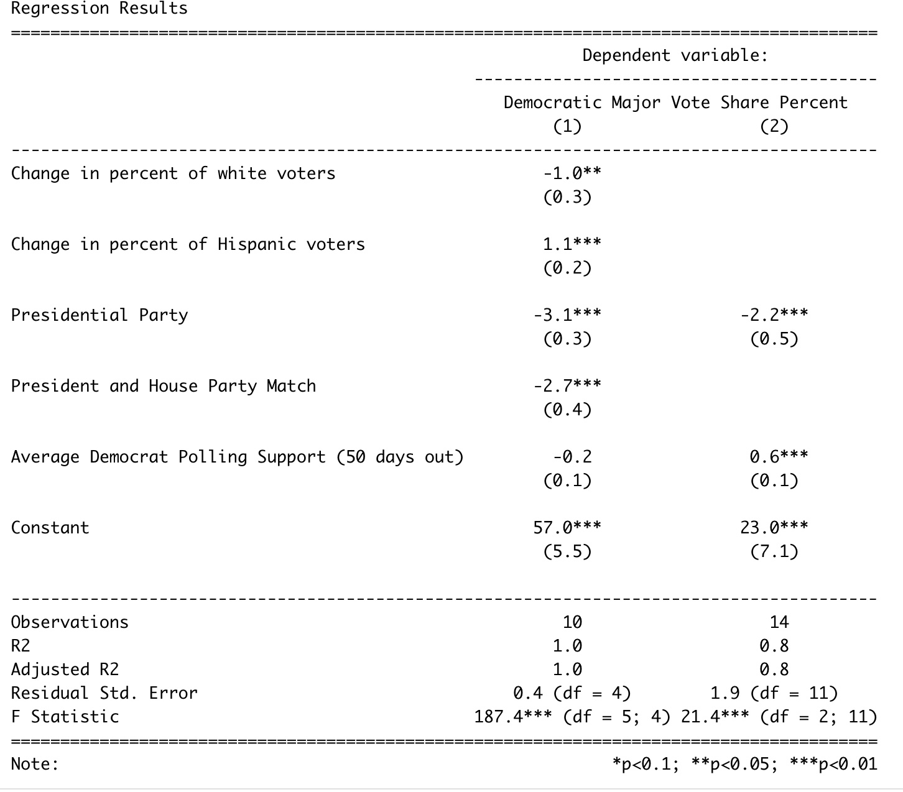

# Introduction:

This week I will be reflecting on the accuracy of my prediction and attempting to understand why and how my prediction differed from the actual results of the election. The results of the election, while still being formalized, appeared to shock most of the country as the anticipated Republican gains did not happen to the extent people were expecting. This so-called “red wave” actually resulted in slight control of the House and a slight majority in vote share. The actual results of the election have not been officially called because of outstanding ballots. However, for the purpose of this blog and my analysis, I will be using [Cook’s national vote share](https://www.cookpolitical.com/charts/house-charts/national-house-vote-tracker/2022), which is 48.3% for Democrats and 51.7% for Republicans. These values come from taking the percentage of each party’s vote and dividing it by the sum of the two parties’ vote share. With regard to the House, I will be using the [New York Times](https://www.nytimes.com/interactive/2022/11/10/us/elections/results-house-seats-elections-congress.html) House projections, which is 213 for Democrats and 222 for Republicans. There are still 4 uncalled races, which is why this value is not certain. 

# Review:

Before I get into the analysis of my model, it is important to review my prediction and how I arrived at my model. As discussed in my [previous blog post](https://anneliesq.github.io/Gov1347-Blog/post/2022-11-08-test/), I evaluated three models and ended up focusing on two models, model 1 and model 3. My official final prediction was from model 1, which both predicted national vote share. However, I will evaluate the success of both models. Below I have listed all the variables I used in the models and the regression outputs:

1.  **Average democrat polling (50 days):** This the average of the democratic generic ballot polls from 50 days prior to the election. The generic ballot is an effective way of understanding the public's view and filtering for the days leading up to the election gets a better sense of the true pulse of the country (Bafumi, Erikson, Wlezien, 2018).

2.  **President party:** This is a binary variable with 1 being Democrat and -1 being Republican. Often the party in power is [punished](https://fivethirtyeight.com/features/why-the-presidents-party-almost-always-has-a-bad-midterm/) during the midterms.

3.  **Presidential and party match:** A binary variable with 1 being the parties match and -1 being the parties don't match. This is a continuation of the previous variable, but my hypothesis is that if the party matches there will be a larger punishment.

4.  **Change in percent of white voters:** This is the white vote share from that election minus the white vote share from the previous election. As seen in lab, white and Hispanic voters had the strongest coefficient toward predicting democratic vote share.

5.  **Change in Hispanic voters:** This the Hispanic vote share from that election minus the Hispanic vote share from the previous election.


```{r, include = F}
# Packages
knitr::opts_chunk$set(echo = FALSE)

install.packages("tidyverse", repos = "http://cran.us.r-project.org")
library(tidyverse)
install.packages("ggplot2", repos = "http://cran.us.r-project.org")
library(ggplot2)
install.packages("blogdown", repos = "http://cran.us.r-project.org")
library(blogdown)
install.packages("stargazer", repos = "http://cran.us.r-project.org")
library(stargazer)
library(lubridate)
install.packages("gridExtra", repos = "http://cran.us.r-project.org")
library(gridExtra)
```

```{r, include = F}
# data
modelDF <- read.csv("finalModels.csv")
```

```{r, include = F}
# Create train data
modelTrain <- modelDF[-c(3,5),] %>% 
  filter(year%%4!=0) %>% 
  select(year,white, hispanic, R_majorvote_pct, D_majorvote_pct, party, partyMatch, aveD)

# Create test data for 2022 prediction
modelTest <- modelDF %>% 
  filter(year > 2018) %>% 
  mutate(party = 1) %>% 
  mutate(UNRATE = 3.5,
         houseParty = 1,
         aveD = 0.506271 * 100,
         aveR = 52,
         partyMatch = 1,
         whiteHis = -.2,
         collegeNO = -.2,
         midterm = 1) %>% 
  select(-c(D_majorvote_pct, D_seats, R_majorvote_pct, R_seats))

# Create test data for model testing
plotTest <- modelDF %>% 
  filter(year%%4!=0) %>% 
  select(-c(D_majorvote_pct, D_seats))
plotTest <- plotTest[-2,]

```


```{r, include = F}
knitr::opts_chunk$set(echo = FALSE)

# Model
fit1 <- lm(D_majorvote_pct ~ white + hispanic + party + partyMatch + aveD, data = modelTrain)
predict1 <- predict(fit1, plotTest)

fit3 <- lm(D_majorvote_pct ~ party + aveD, data = modelTrain)
predict3 <- predict(fit3, plotTest)
```

```{r, include = F}
stargazer <- stargazer(fit1, fit3, type="text", dep.var.labels = c("Democratic Major Vote Share Percent"), title="Regression Results",digits = 1, out = "models.txt", covariate.labels=c("Change in percent of white voters", "Change in percent of Hispanic voters", "Presidential Party","President and House Party Match", "Average Democrat Polling Support (50 days out)"))
```

```{r, echo=FALSE, out.width = "100%", fig.align = "center"}

```
As seen by the table above, my first model considers all five variables, whereas the second just uses presidential party and polling.

The equations for my models are:

## Model 1:
Democratic Major Vote Share = 57 -1(change in white voters) +1.1(change in Hispanic voters) -3.1(presidential party) -2.7(president house match) -0.2(polling)

## Model 3: 
Democratic Major Vote Share = 23 - 2.2(president party) + .6(polls)

## Prediction:
The final prediction was based on the results from model 1. I predicted that Democrats would receive 46.6% of the national vote share and Republicans would receive 53.3% of the national vote share.

My prediction from model 3 was that Democrats would receive 50.48% of the national vote share and Republicans would receive 49.52% of the national vote share. 

# Comparison of Results

## Point Comparison

Below are diagrams that show the predicted and actual value for each model and their predictive ranges.

```{r}
# Prediction intervals
## Democrats
predict1D <- predict(fit1, modelTest, interval = "prediction", level=0.95)

predict3D <- predict(fit3, modelTest, interval = "prediction", level=0.95)


## Republicans
# fit1R <- lm(R_majorvote_pct ~ white + hispanic + party + partyMatch + aveR, data = modelTrain)
# predict1R <- predict(fit1R, modelTest, interval = "prediction", level=0.95)
# 
# fit3R <- lm(R_majorvote_pct ~ party + aveR, data = modelTrain)
# predict3R <- predict(fit3R, modelTest, interval = "prediction", level=0.95)

## Create dataframe to plot
## Using Cook: 47.6% Democrats and 50.9% for Republicans

predictInterval1 <- tibble(model=c("Dem"), predicted=c(predict1D[1,1],48.3), lower=predict1D[1,2], upper=predict1D[1,3], actual=c(1,0))

predictInterval3 <- tibble(model=c("Dem"), predicted=c(predict3D[1,1], 48.3), lower=predict3D[1,2], upper=predict3D[1,3], actual=c(1,0))

plot1 <- ggplot(predictInterval1, aes(model, predicted, colour = factor(actual))) +        
  geom_point(size = 3) +
  geom_errorbar(aes(ymin = lower, ymax = upper)) +
  scale_colour_manual(values= c("black", "purple"), guide="none") +
  ggtitle("Model 1")

plot3 <- ggplot(predictInterval3, aes(model, predicted, colour = factor(actual))) +        
  geom_point(size = 3) +
  geom_errorbar(aes(ymin = lower, ymax = upper)) +
  scale_colour_manual(values= c("black", "purple"),labels=c('Actual', 'Predicted'), name=NULL) +
  ggtitle("Model 3")

grid.arrange(plot1, plot3, ncol=2, widths = c(0.7, .7), top=("Model Prediction Versus Actual (Democratic Vote Share)"))

```
From the above plots, the actual vote share falls within the prediction interval for each model. For model 1, my predicted value is 1.7 percentage points fewer than the actual value . For model 3, my predicted value is 2.18 percentage points greater than the actual value. From this initial comparison, model 1 had a closer prediction than model 3, meaning that my choice to make my official decision off of model 1 instead of model 3 was the correct choice. 
```{r}
# Plotting Residuals
data1 <- data.frame(actual=modelTrain$D_majorvote_pct, fit1=c(predict1), fit3=c(predict3), year=modelTrain$year)
data1[16,] <- c(48.3, 46.6, 50.48, 2022)
```

# Plotting Residuals

To assess the significance of this difference, I looked at the residuals from the past years between the predicted and actual values. The graph below includes the 2022 data and the residuals from both models. From this graph, it appears as though both models have a larger residual than previous years. This is seen by the divergence between the actual (black) line and the model (dashed) lines.

```{r}
plot(data1$year, data1$actual,
type="l",
main="True Y (solid) and Predicted Y (dashed) for Each Year",
xlab= "Year",
ylab= "Dem Vote Share")
lines(data1$year, data1$fit1, col="red", lty =2)
lines(data1$year, data1$fit3, col="green", lty =2)
legend(2007, 58, legend=c("Fit 1",  "Fit 3", "Actual"),
       col=c("red", "green", "black"), lty=2, cex=0.8)
```
I continued to evaluate the residuals by creating a histogram of the residuals between 1982 and 2022 for both models.
```{r}
# Histogram of Residuals
data2 <- data1 %>% 
  mutate(residuals1 = (actual - fit1),
         residuals3 = (actual - fit3)) %>% 
  na.omit()

data3 <- data2 %>% 
  filter(year != 2022)

mean1 <- mean(data3$residuals1)

mean3 <- mean(data3$residuals3)

hist1 <- ggplot(data2, aes(x=residuals1)) + 
  geom_histogram(binwidth = 0.3) +
  geom_vline(xintercept = 1.700000e+00, colour="red") +
  geom_vline(xintercept = mean1, colour="red", lty = "dashed") +
  geom_text(aes(x=1.750000e+00, label="2022", y=4), colour="red") +
  geom_text(aes(x=-mean1 + .3, label="mean", y=6), colour="red") +
  ggtitle("Model 1")

hist3 <- ggplot(data2, aes(x=residuals3)) + 
  geom_histogram(binwidth = 0.3) +
  geom_vline(xintercept = -2.180000000, colour="red") +
  geom_vline(xintercept = mean3, colour="red", lty = "dashed") + 
  geom_text(aes(x=-2.0500000, label="2022", y=1.75), colour="red") +
  geom_text(aes(x=-mean3 + .6, label="mean", y=2.5), colour="red") +
  ggtitle("Model 3")

grid.arrange(hist1, hist3, ncol=2, widths = c(0.75, 0.75), top=("Histogram of Residuals (1982-2022)"))

```
For model 1, the 2022 residual (1.7) was the largest compared to past elections. For model 3, the 2022 residual (2.18) was near the outer edges of the histogram. However, compared to model 1, model 3 was more within the normal distribution of residuals. Although, the difference between the mean residual (excluding 2022 data), and my 2022 prediction was smaller for model 1 than model 3. This means that although my model 1 predication had the largest residual, the range of residuals, including 2022 data, was smaller than that of model 3.

# Hypothesis for Model Inaccuracies

In model 1 and 3, there was a significant incumbency penalty. This is seen by both the presidential party variable and the house party match variable. These two variables also had the strongest coefficients. It is known that the party in power tends to lose during the midterm years. Although I did not include economic factors and approval ratings, the rates of inflation and President Biden’s approval ratings would further validate the hypothesis that the Democratic party would be “punished” via loss of seats and votes in this election. However, I think the impact of abortion rights and former President Trump’s endorsements contributed to a lesser degree of punishment for the Democratic party than suspected, resulting in a higher vote compared to my predicted value. 

In all places where abortion was on the ballot, the favored abortion rights. Further, in [exit polls](https://abcnews.go.com/Elections/exit-polls-2022-us-house-election-results-analysis), abortion was regarded the second highest most significant issue to voters, close behind inflation (31% - 27%). 76% of voters who favored abortion as their top issue voted Democrat. However, only 57% of voters who favored inflation as their top issue voted Republican. This means that abortion helped Democrats about the same if not more as inflation helped Republicans. The impact of abortion demonstrates how the incumbency penalty may have been reduced by the united Democratic push for abortion rights. 

Another explanation for the inaccuracies could be drawn from the role of Trump’s endorsements. When looking at [exit polls](https://abcnews.go.com/Elections/exit-polls-2022-us-house-election-results-analysis), Republicans were more divided over their opinions toward Trump than Biden. 20% of Republicans viewed Trump “unfavorably” whereas 14% of Republicans viewed Biden as “favorably.” The fact that a higher percentage of Republicans disapproved of Trump than the percentage of Republicans who approved of Biden demonstrates that Trump’s endorsements could have contributed to Republicans voting for the democratic candidate. However, his success was limited in key races. For example, in the Pennsylvania and Arizona [governor races](https://www.washingtonexaminer.com/news/campaigns/trumps-general-election-endorsements-fared-midterms), both the Democratic candidates won over the Trump-supported Republican candidates. Trump’s endorsements identify a key area where the GOP is divided, indicating the possibility for Republicans to flip their vote, reducing the incumbency penalty. 

# Proposal to Test Hypothesis
One way to consider the impact of abortion on the ballot would be to include demographics for populations that would appear to most likely turnout to vote in response to the Roe v. Wade decision, such as youth or women. This is based on the fact that youth had an extremely high turnout rate this year, [the second highest in the last three decades](https://circle.tufts.edu/2022-election-center#youth-turnout-second-highest-in-last-three-decades).

Evaluating the effect of Trump is more difficult. However, looking at the impact of endorsements by extremists may be a possible way to test my hypothesis. This data would be difficult to find. One possibility is to look at campaign financing or ad messaging. This could either be a binary variable (endorsed by extremists or not) or could be a value, such as the percentage or total number of endorsers who are  extremists. I think this would be helpful in seeing if votes differ from party alliance when extremists are endorsers. 

# Moving Forward

The process of building my model was difficult and frustrating at times, but overall very rewarding. However, there is certainly room for improvement within my model. As mentioned above, I think considering more demographics such as youth and gender would have improved my prediction. Further, including more racial demographics, such as Black voters, would be helpful considering [Black voters](https://abcnews.go.com/Elections/exit-polls-2022-us-house-election-results-analysis) are a consistently pivotal part of the Democratic vote share. I think that having incumbency is important to include. Although, having two variables may have been unnecessary. Next time, I would have just included the president party variable. Finally, I would have considered adding a variable for midterm year. In my models, my train data was just midterm years. However, using all elections with a midterm variable would have made my train data larger while also considering the impact midterms have. 

Overall, I am happy to have been able to create a model in which the actual value fell within my prediction interval. I learned a lot about forecasting and definitely see myself wanting to continue to improve in this area of data analytics. 

# Extra
## What Happened With the Seat Share Model

As mentioned at the end of my prediction blog, I also included my week 6 seat share model. This model was not the focus of my work, but was included to just have a value to compare the results too. Ironically, this model would have been my strongest model. It predicted 214 seats which is only 1 seat off of the current projected outcome. However, the success of this model quickly fell when I noticed a coding error in the turnout variable of the model. For a few years, I had miscoded turnout as a percentage rather than a decimal. When I adjusted this, the results of my model significantly worsened. For that reason, I decided to not assess the outcome of the model. Although disappointing, I am glad the error was caught. It is very interesting to consider how a miscoded model can perform better than a “correct” model, but demonstrates the variability of elections and the difficulty in predicting them. 

# References
Bafumi, Joseph, Robert S. Erikson, and Christopher Wlezien. "Forecasting the 2018 Midterm Election Using National Polls and District Information." PS: Political Science & Politics 51, no. S1 (2018): 7--11. <doi:10.1017/S1049096518001579>.


