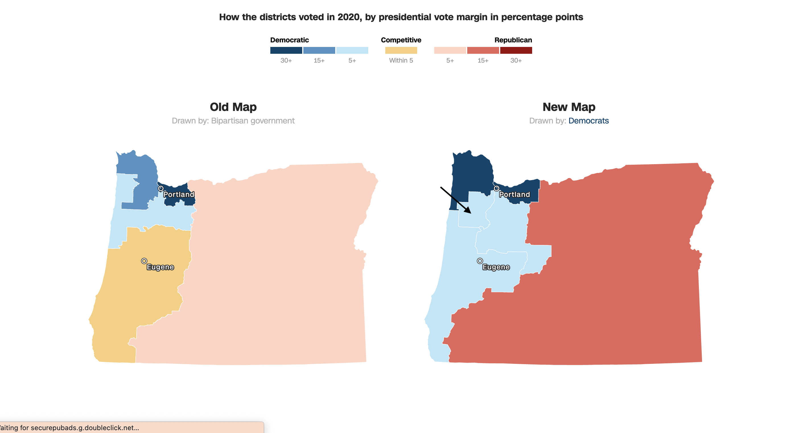

```{r setup, include=F}
# Packages
knitr::opts_chunk$set(echo = FALSE)

install.packages("tidyverse", repos = "http://cran.us.r-project.org")
library(tidyverse)
install.packages("ggplot2", repos = "http://cran.us.r-project.org")
library(ggplot2)
install.packages("blogdown", repos = "http://cran.us.r-project.org")
library(blogdown)
install.packages("stargazer", repos = "http://cran.us.r-project.org")
library(stargazer)
library(lubridate)
library(rmarkdown)
install.packages("quanteda", repos = "http://cran.us.r-project.org")
library(quanteda)
install.packages("quanteda.textstats", repos = "http://cran.us.r-project.org")
library(quanteda.textstats)
install.packages("quanteda.textplots", repos = "http://cran.us.r-project.org")
library(quanteda.textplots)
install.packages("treemap", repos = "http://cran.us.r-project.org")
library(treemap)
```
# Introduction

For my final blog post, I will be looking at Oregon's 6th congressional district by evaluating the effectiveness of the campaigns and analyzing the outcome of the election. I chose OR 6 because I am from Oregon and this district is new because of redistricting. After the 2020 census, Oregon gained an extra seat, making the state go from five to six congressional districts. The content of this blog will be more qualitative compared to previous posts, as much of my analysis will be drawn from news articles and campaign information. 


# Demographics of the District

In order to evaluate the outcome of the election, it is necessary to look into who makes up the electorate and what are the defining characteristics of the district. Due to redistricting, the exact demographics of OR 6 is unknown. However, the district is a combination of the previously drawn OR 1 and OR 5. By looking at these [two districts](https://statisticalatlas.com/state/Oregon/Overview), information for OR 6 can be estimated. OR 1 is  72.3% white, 14.1% Hispanic, 7.3% Asian, and the other 6.3% is either Black, mixed, or another race. In OR 5, 75.9% is white, 16.0% is Hispanic, 2.7% is Asian, and the other 5.4% is either Black, Mixed, or another race. Compared to the state, these demographics are fairly similar. Oregon is 74.1% white and 14.0% Hispanic. Another characteristic to consider is household income. In OR 1 the median income is 66.1k dollars. In OR 5, the median income is 56.5k dollars. The two districts appear to have similar median incomes. Although, OR 5 is much closer to the state’s median household income than OR 1. Oregon’s median household income is $65,667. Finally, we can consider the education of the district. In OR 1, 47.5% of the district received a higher degree than a high school diploma.  In OR 5, 37.8% of the district received a higher degree than a high school diploma. As a state, 39.9% of the state received higher education, which is more similar to OR 5. From this, it is evident that both districts are pretty similar across race and wealth. However, there is a bigger discrepancy with regard to education. When creating assumptions about OR 6, I believe it is fair to say that the racial demographics are about the same as the state, the income status is slightly below the median for the state, and the education is slightly above the average for the state. 

Below is a picture of the change in districts. The arrow points to OR 6. 

```{r, echo=FALSE, out.width = "100%", fig.align = "center"}

```


# Voting History

Without past voting records of the district, looking at the state and OR 1 and OR 5 are the best ways to get a pulse of the political status of the electorate. Looking at the [last 10 years](https://sos.oregon.gov/elections/Pages/electionhistory.aspx), in OR 5, Kurt Schrader, a Democrat, has been the representative. In OR 1, the Democrat David Wu represented the district in 2010 and then Suzanne Bonamici has been the consistent representative of OR 1. Across Oregon, the state has voted Democrat in the Presidential elections since 1988. Additionally, Oregon has had a Democratic governor since 1987.  In the Oregon Senate, Democrats have held control since 2005 and in the House they have had control or shared control since 2007.  These records indicate that Oregon has a strong history of voting blue at a district, state, and national level. From this, it is fair to assume that OR 6 would have a democratic lean. 

# The Race

The two candidates were Andrea Salinas and Mike Erickson. Salinas represented the Democratic party and Mike Erickson represented the Republican party. For Erickson, this is his third run for Congress. In the [primary](https://ballotpedia.org/Mike_Erickson_(Oregon)), Salinas won the Democratic ticket with 36.8% of the vote. Erickson won the Republican ticket with 34.7% of the vote. The primaries provided valuable insight into the pulse of the district. In May, Salinas received 26,101 votes whereas Erickson received 21,675 votes. 


```{r, include = F}
# Read in .txt files and create corpus
texts <- read_csv("texts - Sheet1.csv")

aboutS_corpus <- corpus(texts[1,2],
                    text_field = "text")
aboutE_corpus  <- corpus(texts[2,2],
                    text_field = "text")
```

# Expert Ratings

Polling and expert ratings are a valuable method of understanding what direction the district may go. Leading up to the election, the average expert rating for OR 6 was 4. This average was taken a week out from the election. This is on a 1-7 scale with 7 being “likely Democratic”. A four can be considered as a district “toss-up.”  Additionally, the night before the election, [FiveThirtyEight](https://projects.fivethirtyeight.com/2022-election-forecast/house/) and [The Economist](https://www.economist.com/interactive/us-midterms-2022/forecast/house) predicted a democratic win. This is significant because the two sites rest on very different models, polling heavy versus fundamentals heavy) to get their ratings. This is described in more detail in [Blog 3](https://anneliesq.github.io/Gov1347-Blog/post/2022-09-26-week-3-polling/). However, other sites, such as [Politco](https://www.politico.com/2022-election/race-forecasts-ratings-and-predictions/oregon/house/district-06/) predicted the seat to be a toss-up. Between April and November, their prediction shifted from “Likely Democratic” to “Lean Democratic” and finally “Toss-up”. 

```{r}
# Ratings
expert_ratings <- read.csv("expert_rating_2022-10-27 (1).csv")

expert_ratings <- expert_ratings %>% 
  mutate(avg = ave(cook, rothenberg, sabatos_crystal_ball, real_clear, fivethirtyeight, ddhq, politico, fox, the_economist)) %>% 
  select(year, state, district, last_result, avg)

OR6_ratings <- expert_ratings %>% 
  filter(state=="Oregon", district=="6")
```

```{r, include = T}
OR6_ratings
```

# Result 

In the end [Salinas (D) won the race](https://ballotpedia.org/Mike_Erickson_(Oregon)) with 49.8% of the vote. Erickson (R) received 47.8% of the vote. The two were separated by a little more than five thousand votes. This is a similar difference as with the primaries, demonstrating that the May election was an effective predictor. 

## Comparison

Additionally, when comparing the election results to the predicted, expert ratings, the ratings predicted a tighter race and did not necessarily call Salinas (D) to win. Although the race was very close, Salinas (D) still won by two percentage points, which is fairly decisive. 


```{r, inlcude = T}
# Results

# Create data
candidate <- c("Salinas (49.8%)","Erickson (47.8%)", "Other (2.4%)")
vote <- c(49.8,47.8, 2.4)
data <- data.frame(candidate,vote)
 
# treemap
my_colour_pal <- c("#bc0303", "#FFFFFF","#0096FF")
treemap(data,
            index="candidate",
            vSize="vote",
            type="index",
            palette= my_colour_pal,
            title= "Voting Breakdown",
            fontsize.title=16) 
```

# Analyzing Campaigns

Understanding why Salinas (D) won requires looking at campaign strategies. One method of analyzing the two candidates’ campaigns is to look at their word usage. The word clouds below show the top most repeated words or phrases on each of the candidate's “About” and “Issues” pages of their websites. I decided to use both pages because [Erickson](https://mikeericksonforcongress.org/about/) has far fewer words on his website than [Salinas](https://www.andreasalinasfororegon.com/about/), so using both pages would make for a stronger analysis. Additionally, for Salinas’s word cloud I used two word phrases because she had more text available. For Erickson, one word phrases were the only way to get a high enough frequency within the text to analyze.

```{r, inlcude = F}
# AboutS
# Tokens
aboutS_tokens <- tokens(aboutS_corpus, 
                    remove_punct = TRUE,
                    remove_symbols = TRUE,
                    remove_numbers = TRUE,
                    remove_url = TRUE) %>% 
  tokens_tolower() %>%
  tokens_remove(pattern=stopwords("en")) %>%
  tokens_wordstem() %>%
  tokens_select(min_nchar=3) %>%
  tokens_ngrams(n=2)

aboutS_dfm <- dfm(aboutS_tokens,
               tolower = TRUE)

# Text frequency
aboutS_freq <- textstat_frequency(aboutS_dfm, n = 15)

#head(aboutS_freq, 100)

```


```{r, inlcude = T}
# Word cloud
set.seed(132)
textplot_wordcloud(aboutS_dfm, max_words = 20)
```

## Salinas's Word Cloud

In Salinas’s word cloud the most common phrases are health_care, work_famili, and reproduct_right. She appears to be appealing to people in response to the overturning of *Roe v. Wade*. She also is using some traits to appear to a greater population. For example, her appeal to working families comes from her experience growing up in a working class family and having to start working to help support her family at a young age. There also seems to be a legislative theme in her text. She uses a lot of phrases that involve “pass”, “legisl”. This seems to be an attempt to be seen as qualified in the legislation sphere by frequently referencing her time in the State Legislature. 
```{r, include = F}
# AboutE
# Tokens 
aboutE_tokens <- tokens(aboutE_corpus, 
                    remove_punct = TRUE,
                    remove_symbols = TRUE,
                    remove_numbers = TRUE,
                    remove_url = TRUE) %>% 
  tokens_tolower() %>%
  tokens_remove(pattern=stopwords("en")) %>%
  tokens_wordstem() %>%
  tokens_select(min_nchar=3) %>%
  tokens_ngrams(n=1)

aboutE_dfm <- dfm(aboutE_tokens,
               tolower = TRUE)

# Text frequency
aboutE_freq <- textstat_frequency(aboutE_dfm, n = 20)

#head(aboutE_freq, 100)
```

```{r, inlcude = T}
# Word cloud
set.seed(132)
textplot_wordcloud(aboutE_dfm, max_words = 20)
```

## Erickson's Word Cloud

In Erickson's word cloud there seems to be an economic trend. Within his top words, he uses inflat, spend, protect, and economi. This economic trend follows the beliefs of political theorist Lynn Vavreck. 


## Vaverick’s Theory
In *The Message Matters: The Economy and Presidential Campaigns*, Vavreck describes two types of campaigns: Clarifying Campaign and Insurgent Campaign. Clarifying campaigns are when the economy helps the candidate. This is generally when the candidate is an incumbent and the economy is doing well or when the candidate is a challenger and the economy is not doing well. An insurgent campaign is the opposite: when the candidate is an incumbent and the economy is doing poorly or when the candidate is a challenger and the economy is doing well. She claims that for clarifying campaigns, the economy should be a primary focal point of the candidate’s messaging. Conversely, for insurgent campaigns, another strong issue should be the center of the campaign, and the economy should be avoided (Vavreck 2009). 

When applying Vavreck’s theory to the Salinas’s and Erickson’s campaigns, we see that both seemed to follow Vavreck’s theory. The economy right now can generally be regarded as [poor](https://www.pewresearch.org/politics/2022/10/20/views-of-the-economy-and-economic-concerns/) with high rates of inflation. With President Biden office, Salinas’s should run an insurgent campaign and Erickson should run a clarifying campaign. This is seen with Salinas focusing on another strong issue, reproductive rights. For Erickson, he also appears to focus primarily on the economy, talking about “spending” and “inflation” frequently. With both following Vavreck’s theory, their campaign messaging does not seem to be the reason Salinas won over Erickson.

# Candidate  Quality

Another significant factor to consider is candidate quality. According to [The Economist](https://www.politico.com/2022-election/race-forecasts-ratings-and-predictions/oregon/house/district-06/) Salinas had a higher candidate quality rating than Erickson. This can be seen in a few ways. First, looking at endorsements, Salinas had a much more [robust list](https://www.andreasalinasfororegon.com/endorsements/)  of endorsers at all levels of legislation and involvement. She was endorsed by community leaders, local officials, state representatives, national level politicians, and state and national organizations. On the other hand, Erickson had a much [smaller list](https://mikeericksonforcongress.org/endorsements/) and the endorsers were all  primarily at the state level. Another measure of candidate quality can be seen through experience. Salinas has worked in legislation for around 20 years, including 5 years in the Oregon State Legislature. Erickson does not have as much concrete legislative experience, as his professional career has been in a more business related realm. Finally, an important aspect of candidate quality is the public’s perception of them. For Erickson, this was tainted by the media releasing past reports of him pleading guilty to a DUI. They also shared the report of him paying a woman he was having an affair with to get an abortion, despite his strong campaigning on [family values](https://oregoncapitalchronicle.com/2022/09/27/tough-on-crime-oregon-congressional-candidate-mike-erickson-had-2016-dui-drug-charges/). These reports on Erickson, his lack of endorsements, and his lack of legislative experience indicate that Erickson has a lower candidate quality than Salinas. This is significant as FiveThirtyEight determined that [candidate quality](https://fivethirtyeight.com/features/candidate-quality-mattered/) was very significant in the outcome of the 2022 Midterms. 

# Deviation

One of the main reasons why the results of this election could have been seen as “more democratic” than predicted could be with the issue of abortion. As described in my [previous blog](https://anneliesq.github.io/Gov1347-Blog/post/2022-11-22-reflection-on-model/), in all places where abortion was on [the ballot](https://www.nytimes.com/interactive/2022/11/08/us/elections/results-abortion.html), people voted for more reproductive rights. In the case of Salinas, who campaigned heavily on reproductive rights, this voting trend likely played a role in her getting votes. Another key group that may have contributed to Salinas was the [Hispanic population in the district](https://www.opb.org/article/2022/10/25/latino-voters-oregon-new-6th-district-mike-erickson-rep-andrea-salinas/ ). Aside from white people, Hispanics make up the next largest race in Oregon. Salinas discusses how her father immigrated from Mexico and has very progressive stances on immigration. This definitely could have helped her win part of this community’s vote, especially considering that Erickson has much more conservative views toward immigration. 

# Conclusion

By looking at demographics, voting history, and expert ratings, it seemed very plausible that the district would likely go democrat. This was confirmed through looking at the candidate’s speeches, overall quality, and key characteristics of their campaign that connected them to certain populations.  


# References

Vavreck, & Vavreck, L. (2009). The message matters. In 2009. 232 pp (STU - Student edition, pp. xxiii–xxiii). Princeton University Press. https://doi.org/10.1515/9781400830480

